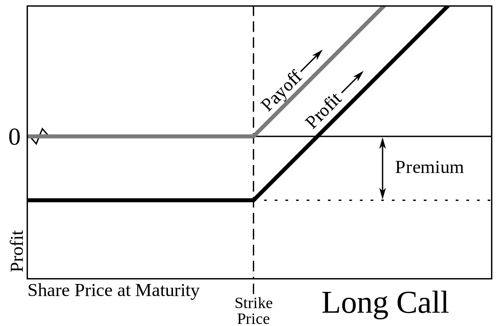

[back to main](../../../../README.md)

# Pricing an Option with/out Copilot

What is a Call Option ? by ChatGPT
https://sharegpt.com/c/biCFGS5

In a few bullet points specifics to today's exercise:
- if you buy a Call Option of a given Stock you pay a flat fee for it: it is the Option's price. Note: that is your maximum loss.
- if the Stock's price at option's maturity is above the Strike price: you have a profit aka Payoff. It is Stock price - Strike price. 
- if it is below you have nothing to do: you have a loss of Option's price amount.

Some examples:
- Profit:
   - you buy a 5€ Call Option for an Amazon Stock, maturity 1y from now. Strike price is 100.
   - at maturity (one year later), the Stock price is 120.
   - Stock price is above Strike Price: you exercise the option.
   - Payoff: 120 - 100 - 5 = +15€.
- Loss:
   - you buy a 5€ Call Option for an Amazon Stock, maturity 1y from now. Strike price is 100.
   - at maturity (one year later), the Stock price is 90.
   - Stock price is below Strike Price: you do not exercise the option.
   - Payoff: -5€.
- Break-even:
  - you buy a 5€ Call Option for an Amazon Stock, maturity 1y from now. Strike price is 100.
  - at maturity (one year later), the Stock price is 105.
  - Stock price is above Strike Price: you do exercise the option.
  - Payoff: 105 - 100 - 5 = 0€.

Payoff can also be represented visually like this:

**Instructions:**
Write a program that calculates the cost (price) of a Call Option.
For the purpose of this time-boxed exercise, the Call Option will be very simple:
- Strike Price 100€.
- Initial Price 100€.
- Maturity 3 months (90 days).
- Volatility, daily, is 1%.
- we will do 100 000 Monte Carlo simulations.
- for each Monte Carlo simulations we will calculate the gain/loss associated to it aka its Payoff.
- we will then take the average of all the payoffs to estimate what should be the minimum price of our Call Option.

The tricky parts here are:
- how to do 1 Monte Carlo simulation: see MonteCarloPriceSimulator.getPrice() method in the project as one possible way to achieve it.
- how to code the payoff calculations: the 3 examples above should help you.

You also have a helper method BarChart.plotPoints() which produces a bar chart from an array of points.
It can be useful if you want to validate that your Monte Carlo simulations follows normal distribution.

[back](part1.3.md) / [conclusion](conclusion.md)
